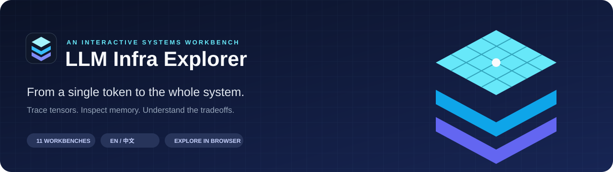
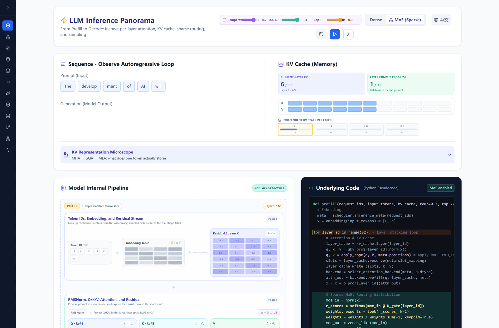
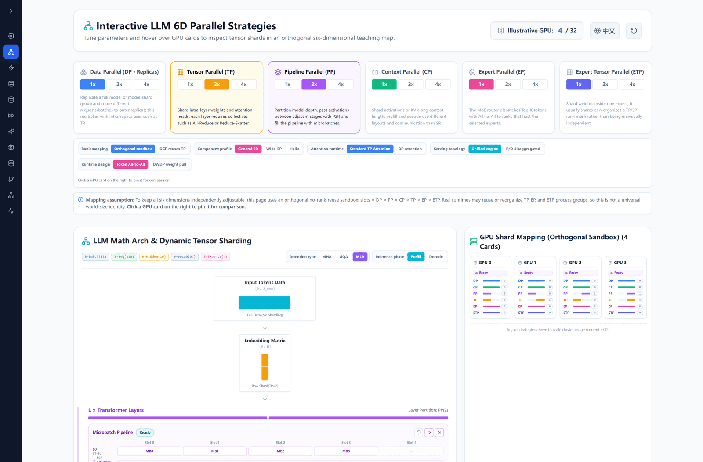
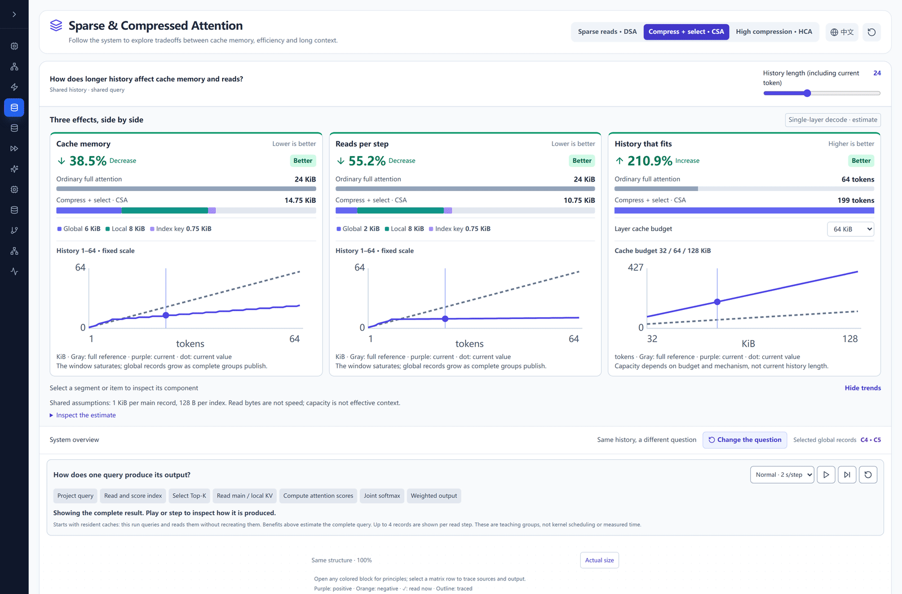
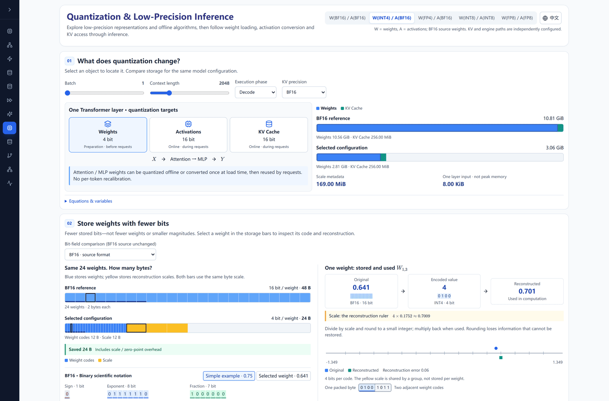
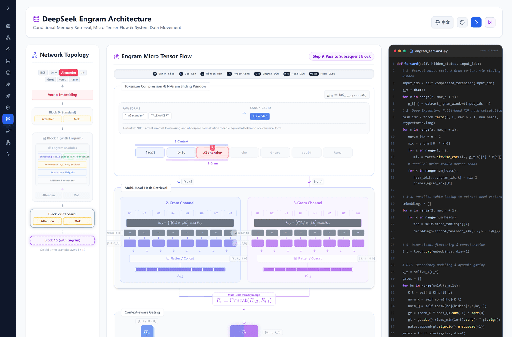

[](https://skyliulu.github.io/LLM-Infra-Explorer/)

**[Open the Workbench ↗](https://skyliulu.github.io/LLM-Infra-Explorer/)** · [English](./README.md) · [简体中文](./README.zh-CN.md)

React · Vite · Interactive matrices · Step-by-step execution · AGPL-3.0

**Make LLM infrastructure visible.** Trace execution, inspect tensors and memory, and see how the whole system fits together.

| See the system | Open the microscope | Follow execution |
| :--- | :--- | :--- |
| Compare architectures, memory ownership and resource costs. | Click components and matrix records to inspect inputs, outputs and provenance. | Play, pause and step through ordered operations at your own pace. |

## Choose a question, then explore

| Area | Workbench | What you can investigate |
| :--- | :--- | :--- |
| Inference | [**LLM Inference ↗**](https://skyliulu.github.io/LLM-Infra-Explorer/#llm) | Prefill/decode, per-layer KV, Dense/MoE, temperature and sampling. |
| Distributed | [**Parallel Strategy ↗**](https://skyliulu.github.io/LLM-Infra-Explorer/#parallel) | DP/TP/PP/CP/EP/ETP, tensor shards, GPU ranks and runtime topology. |
| Attention | [**Flash Attention ↗**](https://skyliulu.github.io/LLM-Infra-Explorer/#flash) | Standard vs V1–V4; tiles, SRAM/HBM and IO traffic. |
| Attention | [**Sparse Attention ↗**](https://skyliulu.github.io/LLM-Infra-Explorer/#sparseattn) | DSA, CSA, HCA, local windows, record provenance and query execution. |
| Attention | [**Flash Decode ↗**](https://skyliulu.github.io/LLM-Infra-Explorer/#flashdecode) | Split-K, paged KV, head sharing and parallel reduction. |
| Generation | [**Speculative Decoding ↗**](https://skyliulu.github.io/LLM-Infra-Explorer/#speculative) | Draft–Target verification, rejection correction, EAGLE-2 and DSpark. |
| Low precision | [**Quantization ↗**](https://skyliulu.github.io/LLM-Infra-Explorer/#quantization) | BF16, INT4/INT8, FP8/FP4; offline algorithms and engine execution. |
| Memory | [**Engram ↗**](https://skyliulu.github.io/LLM-Infra-Explorer/#engram) | N-gram retrieval, context-aware gates and memory movement. |
| Memory | [**Radix Cache ↗**](https://skyliulu.github.io/LLM-Infra-Explorer/#radixcache) | Prefix sharing, reference locks, eviction and KV allocation. |
| Distributed | [**DP Attention ↗**](https://skyliulu.github.io/LLM-Infra-Explorer/#dpattention) | KV ownership and the communication paths into FFN/MoE. |
| Attention | [**Linear Attention ↗**](https://skyliulu.github.io/LLM-Infra-Explorer/#linearattn) | Softmax, kernelization, recurrent state and GLA gates. |

## Inside the workbench

Explore the current **English workbenches in motion**: start with the overview, see connected views respond, then move into the details. Click a demo to open its chapter, or use the native-resolution video and full-workbench overview below it.

### 01 / Inference — tokens, cache and the execution pipeline

Start with the token sequence, layer KV cache, tensor pipeline and engine code together. Replay prefill, inspect attention and MoE, then return to the overview with the updated state.

[](https://skyliulu.github.io/LLM-Infra-Explorer/#llm)

[Open chapter ↗](https://skyliulu.github.io/LLM-Infra-Explorer/#llm) · [HD video](./media/previews/llm-inference.mp4) · [Full workbench overview](./media/previews/llm-inference.png)

### 02 / Parallel strategies — from tensor shards to GPU topology

Compose parallel dimensions and watch tensor ownership, layer partitioning and the physical GPU map change together.

[](https://skyliulu.github.io/LLM-Infra-Explorer/#parallel)

[Open chapter ↗](https://skyliulu.github.io/LLM-Infra-Explorer/#parallel) · [HD video](./media/previews/parallel-strategies.mp4) · [Full workbench overview](./media/previews/parallel-strategies.png)

### 03 / Sparse Attention — tradeoffs, architecture and query execution

Compare memory and traffic first, follow one Query through the connected architecture, then drill into a component without losing the system view.

[](https://skyliulu.github.io/LLM-Infra-Explorer/#sparseattn)

[Open chapter ↗](https://skyliulu.github.io/LLM-Infra-Explorer/#sparseattn) · [HD video](./media/previews/sparse-attention.mp4) · [Full workbench overview](./media/previews/sparse-attention.png)

### 04 / Quantization — precision, storage and runtime

Tour precision controls, storage and reconstruction, offline preparation and the inference engine—not just one bit field.

[](https://skyliulu.github.io/LLM-Infra-Explorer/#quantization)

[Open chapter ↗](https://skyliulu.github.io/LLM-Infra-Explorer/#quantization) · [HD video](./media/previews/quantization.mp4) · [Full workbench overview](./media/previews/quantization.png)

### 05 / Engram — architecture, retrieval and system dataflow

See network topology, N-gram retrieval and engine code together, then follow projection, gating, residual fusion and system data movement.

[](https://skyliulu.github.io/LLM-Infra-Explorer/#engram)

[Open chapter ↗](https://skyliulu.github.io/LLM-Infra-Explorer/#engram) · [HD video](./media/previews/engram.mp4) · [Full workbench overview](./media/previews/engram.png)

### A useful way to explore

**Compare → change a parameter → inspect a record → step through the result.**

Cooperating subsystems stay together in one architecture; switches represent genuine alternatives. Ordered processes support playback where it helps explain execution. Sparse Attention defaults to **2 seconds per step**, with speed, pause and single-step controls. Every module supports English and Chinese.

> **Reading the numbers:** resource estimates follow each module's stated assumptions and sources. Stored bytes, transferred bytes, supported history and measured latency are different quantities. Animation time is a teaching pace, not a GPU benchmark.

## Run locally

Requires Node.js and npm.

```bash
git clone https://github.com/skyliulu/LLM-Infra-Explorer.git
cd LLM-Infra-Explorer
npm install
npm run dev
```

Open the local URL printed by Vite. To build and inspect the production site:

```bash
npm run build
npm run preview
```

**Built with** React 18, Vite, Tailwind CSS, Framer Motion and KaTeX. The application is a static SPA deployed with GitHub Pages.

## What comes next

- **Serving:** continuous batching, request scheduling and multi-tier KV memory.
- **Distributed execution:** expert load balancing, interconnects and collective communication.
- **Measured performance:** hardware-backed profiles, TTFT/TPOT and end-to-end tradeoffs.

These are candidate directions, not a delivery schedule. [Suggest a topic or report an issue](https://github.com/skyliulu/LLM-Infra-Explorer/issues). Technical corrections are especially welcome—include a source, the module and the parameters needed to reproduce the issue.

### Maintaining these previews

Animations are recorded from real module controls with `scripts/capture-readme-motion.cjs`; the first overview frame is also saved as the companion PNG. With Playwright, Chromium and FFmpeg available, start the app and run:

```bash
node scripts/capture-readme-motion.cjs
```

`PREVIEW_URL` selects another local server. Capture states and runtime errors are recorded in `media/previews/motion-capture.json`. GIFs are encoded up to 1600 pixels wide; videos and stills retain the original capture resolution.


For a local browser preview with relative images and GIF playback, run `node scripts/preview-readme.cjs` with `marked` available, then open the address printed in the terminal. This preview uses GFM parsing; GitHub controls its own surrounding styling.

## License

[GNU Affero General Public License v3.0](./LICENSE). Commercial use and network deployment are subject to its terms.
