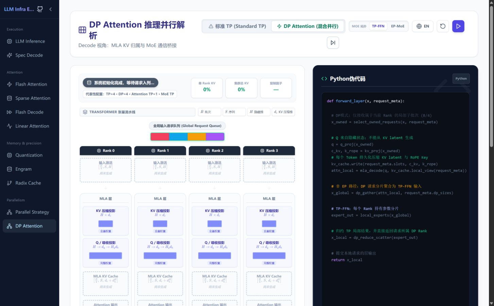
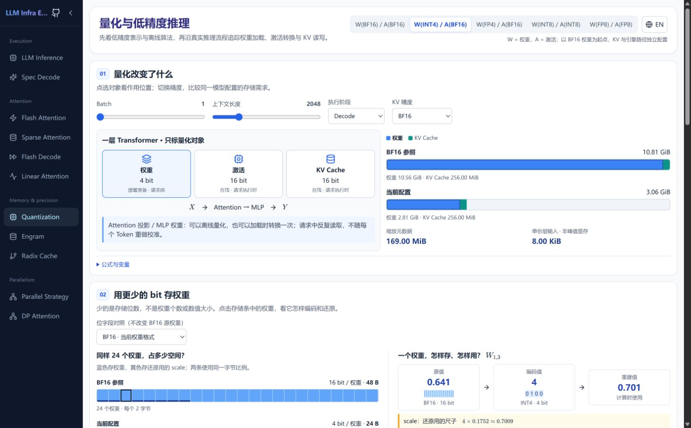
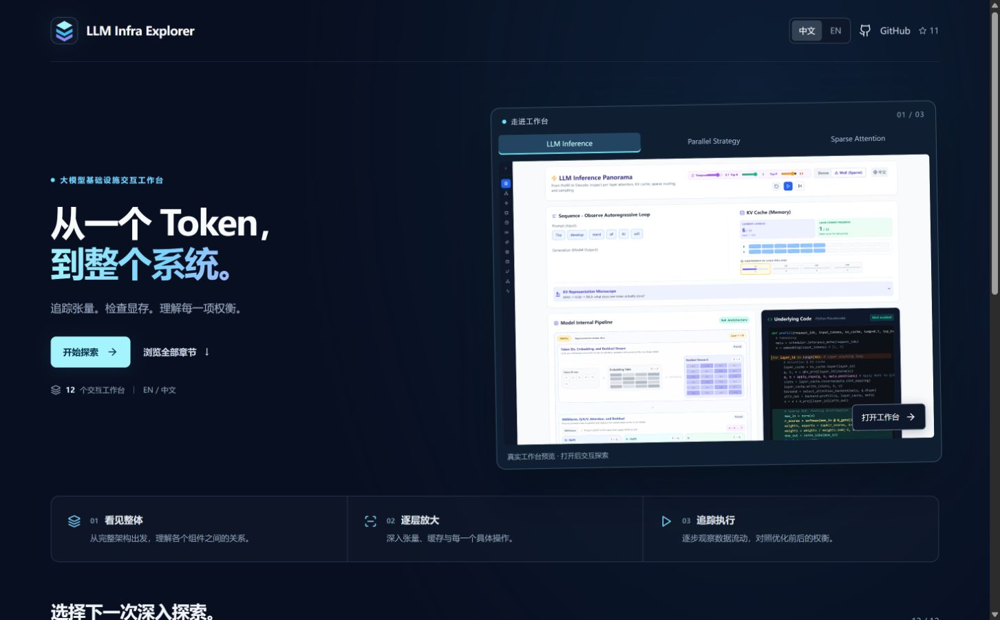

# 工作台产品化审查

2026-09-12。范围：新版本地首页、线上 DP Attention / Quantization、当前公共界面代码。仅 review，未修改产品界面。线上尚未包含本地 CED 提交，章节数量差异不是本次缺陷。

## 观察步骤与证据

1. 打开现有线上 DP Attention：品牌文字被窄侧栏截断；GitHub 与折叠按钮占据同一行；章节标题、算法选择、语言和播放操作混排，下一步按钮落到第二行。

2. 切换到 Quantization：独立标题卡片、另一套控件间距，语言仍在章节内。章节自身参数分区有效，应保留；不需要让它套用 DP Attention 的整页播放布局。

3. 对照新版本地首页：已有清晰的图标品牌组合和右侧站点操作，但进入工作台后没有延续同一公共界面。首页中英文分段选择与章节语言按钮的形态不同。

## 建议及顺序

| 优先级 | 改造 | 具体行为与验收 |
|---|---|---|
| P0 | 全站语言偏好 | 一个公共入口，首页与章节共享。已保存的用户选择优先，其次浏览器语言，最后英文。刷新、换章节保持选择；语言变化不重置参数、选择和播放进度。侧栏按用户要求固定英文。 |
| P0 | 公共品牌与操作栏 | 使用同一个 Logo/品牌组件。工作台顶部用约 48px 的紧凑栏容纳品牌、语言与 GitHub；侧栏专注英文分类和章节，不再挤品牌长标题和 GitHub。折叠侧栏时仍能回首页。首屏画布面积作为验收指标。 |
| P1 | 章节标题与控制规范 | 保留每章一张简洁标题卡：标题、教学问题和章节级算法/配置。局部播放、重置留在所控制的画布旁；控制组整体换行，避免下一步孤立。统一按钮尺寸、图标、选中/禁用态与 tooltip。 |
| P1 | 跨章节行为契约 | 共享语言与导航折叠偏好；明确切换章节后实验参数是否保留。建议保留配置但不在后台继续播放。章节链接使用真正的链接以支持新标签页。移动菜单补充 Escape 关闭、焦点管理与返回触发器。 |
| P1 | 视觉基础规范 | 统一页面边距、标题级别、卡片/边框、表单密度及断点；保留深色外壳和浅色画布。品牌色用于公共操作，不改写算法的颜色语义；不要强制所有章使用相同列数。 |
| P2 | 内容发现与分享 | 增加轻量章节搜索，支持中英文、缩写及别名；长章节增加章内目录；动态网页标题显示当前章节。后续再增加可复现参数的分享链接与前置/相关章节入口。 |

## 组件边界

- SiteHeader：品牌、首页入口、语言偏好、GitHub；每个页面只出现一份。
- ChapterNavigation：固定英文分类与章节、当前项、折叠控制；保持已认可的176px/56px宽度。
- ChapterHeader：章节名称、教学问题和章节级比较/参数；不持有站点语言状态。
- PlaybackControls：统一外观与语义，放在真实控制范围旁，不给没有时间线的模块添加播放。
- PreferenceProvider：用户偏好统一来源；章节计算模型不依赖语言，避免切换语言导致重新初始化。
- ChapterRegistry：组件、标题、分类、描述、关键词共用一个清单；当前首页和路由仍各自维护入口，后续容易漏项。

## 建议实施批次

1. 公共品牌栏 + 全站语言偏好 + 英文侧栏整合。先用 DP Attention 与 Quantization 两个结构不同的章节验证，再覆盖全部章节。
2. 共用章节标题、控件与视觉变量，清理重复入口；保留各算法的组织关系。
3. 导航/参数保留、章节搜索、章内定位及分享。

## 可访问性及范围

已观察到小字号分类、部分仅图标按钮和控制组拆行；这些需要补充触达面积、对比度、键盘焦点与窄屏测试。当前代码虽有 aria-label/aria-current，不能由截图推断完整无障碍合规。此次没有穷举所有章节、移动尺寸或读屏流程，也未验证实际用户完成任务的耗时。语言独立状态和公共入口职责来自代码检查，其余视觉结论对应本次截图。
