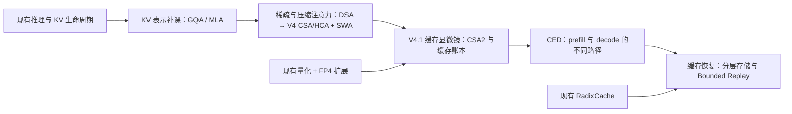

# DeepSeek V4.1 Flash：KV Cache 技术链路与交互模块规划

研究日期：2026-09-11。范围：官方材料核验、项目内容盘点、教学与实现规划；本轮未修改交互组件，不代表新模块已实现或通过渲染 QA。

## 1. 核心判断

应围绕“一个历史 token 最终以什么形式、由谁保存、被谁读取、如何恢复”建立学习路径。DSA 是必要的稀疏选择基础，但不足以解释 V4.1 的缓存压缩。关键链路是：KV 表示 → DSA → SWA 与 V4 CSA/HCA → V4.1 CSA2 跨层共享 → FP4 主 KV → CED 与 Bounded Replay。

官方 2026-09-10 发布；技术报告 Figure 1 的全局 KV 数字为 V4-Flash 3,514 bytes/token、V4.1-Flash 890 bytes/token，约缩小 3.95 倍。比较对象应明确为 V4-Flash，而非笼统的 V4 或 V4-Pro。[S1][S2]

这里的 global KV 包括 main KV 和 indexer K，不包含所有运行时内存。SWA 窗口、压缩器暂存、临时激活、分配器、权重及跨设备复制要分账。SSD/host 长期持久化缓存降至约 1/8，则叠加了取消 SWA 长期持久化的部署策略，依赖报告中的工作负载。[S2 §1、§3.2]

## 2. 原理及不能混淆的边界

| 机制 | 实际改变 | 教学边界 |
|---|---|---|
| MLA / GQA | 每个位置的 KV 表示与共享方式 | MLA latent 不能画成每头一份完整 K、V；该前置用于理解表示，不意味着 V4.1 原样沿用 V3 的全部 MLA 路径 |
| DSA | 轻量 indexer 打分，Top-K 决定本次主 attention 读取哪些历史位置 | 当前未选中的 KV 不等于删除；indexer 本身有存储和计算成本 |
| V4 CSA/HCA + SWA | 全局历史沿 token 轴压缩，并保留逐层局部窗口 | CSA 和 HCA 是不同全局分支：CSA 对压缩项再稀疏选择，HCA 对更强压缩后的项计算注意力 |
| CSA2 | 多层共享 main KV / indexer K，并可复用 Top-K | 缓存共享与索引复用分开；共享 KV 不代表共享 Q 或 attention 输出 |
| Hierarchical Sparse Indexer | decoder 后续 Reindex 只在候选池内打分 | 首个 Full 仍扫描全部因果可见位置；不能宣称全部索引成本与上下文无关 |
| FP4 main KV | 每条主 KV 的存储字节减少 | main KV、indexer K、SWA 的格式不同；不能把所有缓存统一算成 4 bit |
| CED | decoder 全局 KV 来源改为最终 encoder hidden states，减少 prefill 深层计算 | decoder 的 SWA 仍来自各自层的 hidden states，不能把 decoder 在 prefill 中完全删掉 |
| SWA Bounded Replay | 缺失的局部状态通过有限尾段重放近似恢复 | 并非数学等价；不能把恢复结果标为无损或宣称质量保证 |

DSA 依据 [S3 §2.1–2.3]；V4 依据 [S4 §2.2、§3.5、§4.2]；V4.1 依据 [S2 §2.2–2.4、§3.2]。

V4-Flash 的 CSA 压缩率为 4、HCA 为 128。V4.1 不再使用 CSA/HCA 交替的全局架构，而采用 CSA2：encoder 的全局缓存压缩率为 2，decoder 为 1。因此“新版把每组 token 合并得更多”会反转真实设计结论。V4.1 将更多压缩压力转向层间共享和数值精度。[S2 §4.2.1][S4 §4.2.1]

CSA2 的三种模式在模型配置中静态分配，不能画成运行时依据输入临时选择：

| 模式 | main KV / indexer K | Top-K | 各层仍独立计算 |
|---|---|---|---|
| Full | 当前 Full 产生并拥有 | 新计算 | main Q、SWA KV、attention 输出 |
| Reindex | 引用最近 Full 的缓存 | 当前层 indexer Q 重新打分 | main Q、SWA KV、attention 输出 |
| Reuse | 引用最近 Full 的缓存 | 复用最近 Full/Reindex 的选择 | main Q、SWA KV、attention 输出 |

## 3. 可复算的 890 bytes/token 账本

依据报告 §2.4.4、§4.2.1 与 MXFP4 存储布局，以下是逻辑紧凑存储推导，不是对公开 Python 程序显存占用的测量。

- 40 层中前 2 层仅 SWA。
- 其后 18 个 encoder 层分 3 组：每组 1 个 Full + 5 个 Reuse；每组拥有 1 份 2:1 全局缓存。
- 20 个 decoder 层共享 1 份 1:1 全局缓存：1 个 Full、4 个 Reindex、15 个 Reuse。
- 每个全局条目的 main KV 有 512 个通道：E2M1 数据加每 16 通道一个 E4M3 scale。
- indexer K 有 128 个通道：MXFP4 数据加每 32 通道一个 E8M0 scale。公开参考代码也区分这两种分组。[S5]

$$
B_{\mathrm{main}}=512\times\frac{4}{8}+\frac{512}{16}\times1=288\ \mathrm{bytes}
$$

$$
B_{\mathrm{index}}=128\times\frac{4}{8}+\frac{128}{32}\times1=68\ \mathrm{bytes}
$$

$$
b_{\mathrm{global}}=\left(3\times\frac{1}{2}+1\right)(288+68)=890\ \mathrm{bytes/token}
$$

这里 3/2 表示三个 encoder 缓存组按 token 数折算，1 表示 decoder 的一个缓存组。小序列应用完整压缩组计数并单列未完成组暂存，不能直接用渐近值代替全部实时占用。

1,000,000 tokens 对应约 890 MB（十进制）全局缓存；该数值不等于一个请求的完整显存预算，更不能直接转换成实际 GPU 可并发请求数。

SSD 的约 1/8 另行计算：报告部署中 V4 的持久化 SWA 约占一半，移除该部分后，剩余全局缓存再缩至约 1/4。新系统仍保留 encoder SWA 的短 TTL 分布式 DRAM 池，不能画成 SWA 只存在 GPU 或彻底不缓存。decoder SWA 用于 decode，不作前缀缓存。[S2 §3.2]

## 4. 项目已有基础与缺口

本轮基于当前源码、路由与设计记录盘点；不是全站新一轮视觉验收。

| 已有模块 | 可承接内容 | 尚需补齐 |
|---|---|---|
| `LLMInference.jsx` / `llm-inference/model.js` | prefill/decode、逐层计算、KV 生命周期、张量工作台 | MHA/GQA/MLA 表示差别，局部/全局缓存区分 |
| `DpAttention.jsx` | MLA latent、RoPE key、跨 rank 所有权 | 当前主问题是 DP/TP 归属，不能代替 MLA 表示原理章节 |
| `FlashAttention.jsx`、`FlashDecode.jsx` | attention 的 IO、分块、归约 | DSA 的 indexer 与 Top-K；减少 IO 和改变历史表示要分开 |
| `Quantization.jsx` / `quantization/model.js` | INT4/INT8/FP8、在线 KV、scale、数值误差 | 主 KV E2M1 + E4M3/16，indexer MXFP4，以及量化后读取路径 |
| `RadixCache.jsx` | 前缀复用、缓存分配、LRU | global 命中但 SWA 未命中、DRAM/SSD 分层、近似重放 |
| `LinearAttention.jsx` | 固定递归状态与逐 token 历史对比 | 可作旁支对照；CSA2 全局缓存仍随历史增长，不是固定状态 |
| `Engram.jsx`、`SpeculativeDecoding.jsx` | 条件记忆与推测解码 | V4.1 Engram/DSpark 可后续扩展，不作为解释 890 bytes 的前置 |

当前入口 `src/MainDashboard.jsx` 有 10 个模块，未见 DSA、CSA/HCA、CSA2 或 CED 独立入口。建议新增聚焦章节，保持已有章节的学习任务，不把所有新机制塞进 LLMInference。

## 5. 建议的最小教学路径

建议按 **3 个新增章节 + 2 个小范围基础扩展** 落地：

1. **稀疏与压缩注意力**：包含 DSA 基础，以及 V4 CSA/HCA + SWA。若单章密度过高，再拆分入口；先不用为每个缩写增加导航项。
2. **V4.1 缓存架构**：CSA2、真实 40 层拓扑、层间缓存所有权、FP4 账本、分层 indexer、CED 路径。
3. **缓存持久化与恢复**：存储层级、会话命中状态、encoder/decoder 两种 Bounded Replay。
4. 基础扩展：KV 表示的 GQA/MLA 小型工作台；现有量化模块增加 FP4 数值与缓存布局。

## 6. “显微镜式”交互如何体现

每一次放大都保留同一个 token、缓存条目与所有者标识，逐层显示它们的对应关系。

| 教学问题 | 用户动作 | 必须看见的变化 | 边界状态 |
|---|---|---|---|
| 稀疏读取省在哪里？ | 切换 query，调整教学 Top-K | 打分排序、选中地址与读取量改变；未选中缓存仍存在 | 历史少于 K、因果边界、并列分数 |
| token 压缩和稀疏选择有何不同？ | 对比 DSA 与 CSA，推进压缩组 | 多个源 token 贡献合并为一个条目，再从条目中选择 | 不完整组不得提前可见；窗口覆盖最新 token |
| 为什么 40 层不保存 40 份全局 KV？ | 点选 Full/Reindex/Reuse 层 | 所有者连线、真实分配数、引用关系一起改变 | Reuse 输出仍不同；main Q/SWA 仍独立 |
| 890 bytes 是什么组成？ | 从层图点入缓存组，再展开一条记录 | 512 通道、FP4 打包、32 个 scale；indexer 另计；总账联动 | scale、padding、暂存不能混入同一口径 |
| 分层 indexer 如何减少扫描？ | 增大上下文、切换 decoder indexing 层 | 首层全局扫描；后层候选池上限 16,384，再选 512 | 候选池未满、非法未来位置、短上下文 |
| prefill 为什么不用跑完整 decoder 历史？ | 同一请求切换 prefill/decode | encoder 全历史计算；decoder 全局投影与尾段 SWA replay；decode 经全部层 | 128-token 窗口以内、首个输出 token |
| 命中全局缓存后为什么还要计算？ | 模拟 SWA 过期后继续会话 | SSD 全局 KV 载入、尾部 128 tokens 重放、新后缀正常写入 | 原有全局 KV 不重写；近似状态醒目标记 |

真实配置模式固定官方 layer map、压缩率和格式；教学实验模式允许改参数，但明确标为假设配置。参数实验不能声称代表重新训练模型的精度或吞吐。

结构观察使用点选与追踪，不强制全局播放。DSA 查询、压缩写入、会话恢复这些有真实顺序的过程使用单步/播放。复用当前顶栏、双语、MathFormula 与响应式规范。

## 7. 工程任务与验收顺序

### P0：先落实正确性基础

- 固定官方报告和参考实现版本/提交，记录版本、页码、配置与证据边界。
- 建立缓存 schema：token/entry/group 身份、owner layer、消费者、格式、scale、存储层、生命周期。
- 用独立纯函数计算全局条目数、字节数、SWA 占用、选中地址和重放范围；先复算 890，再做视觉。
- 保留“官方模型预算”与“教学小矩阵”两种尺度，避免画面上 16 个 token 却标成百万 token 实测。

### P1：最先可交付的纵向切片

- KV 表示短补课 + DSA 查询步进。
- V4 压缩全局历史与 SWA 对照。
- V4.1 静态层图 → 缓存引用 → 单条字节布局，完整解释 3,514 → 890。
- 量化模块增加 FP4 布局与误差示例。量化质量示例标为教学样本，不外推 checkpoint 精度。

这一切片先回答核心的“1/4 从哪来”，不必等所有 infra 扩展完成。

### P2：把模型结构接到运行时

- CED 的 prefill/decode 路径与 encoder 输出的来源追踪。
- Hierarchical Sparse Indexer 候选池与每层选择。
- global/SWA 分离缓存、短 TTL DRAM 池、SSD 持久化、两类 Bounded Replay。
- 用相同会话轨迹比较字节传输与重放 token 数；SSD 1/8 标为报告工作负载下的结果。

### P3：旁支架构与基础设施扩展

- Single-Pass mHC / Mega-mHC：残差混合与激活内存流量。
- Engram 新配置、DSpark 的半自回归 draft 与置信度调度。
- EPD 分离、kernel fusion、训练时跨 PP stage 的共享状态管理。
- 原生视觉输入与 vision encoder。EPD 的视觉 encoder 不应与 CED causal encoder 混为同一个对象。

这些是 V4.1 的其他变化，但不是复算 KV 压缩率的必要前置。

### 验收

- 模型测试：890 账本、奇偶序列长度、共享不重复分配、Reindex 更新选择、Reuse 不重算索引、候选池因果范围、replay 不覆盖已有 global KV。
- 对参考实现做证据边界核验：公开 minimal inference 不是生产 serving engine。例如代码先生成全范围 index scores 再掩码候选位置，可说明选择语义，但不能用该代码证明生产实现已避免全范围打分计算。[S5]
- 浏览器交互：切换模式/参数/语言后画布、指标、公式、解释一致；不兼容进度确定性重置。
- 渲染：中文、英文、桌面和窄屏；高密度层图与字节布局可读；记录真实截图及操作路径。
- 实现阶段运行 convention checker、纯模型回归与 build，并在 `design-qa.md` 记录最终证据。本次只做研究规划，不运行与文档无关的构建，不宣称已有模块通过新验收。

## 8. 来源

- [S1：官方发布，2026-09-10](https://deepseek.com/news/deepseek-v4-1-flash/)
- [S2：DeepSeek-V4.1-Flash Technical Report](https://huggingface.co/deepseek-ai/DeepSeek-V4.1-Flash/blob/main/DeepSeek_V41_Tech_Report.pdf)：重点 Figure 1、Figure 3–5；§2.2、§2.3、§2.4.4、§3.2、§4.2.1。本轮已下载全文并提取上述章节，渲染核对 Figure 1 的 3,514 / 890 数值。
- [S3：DeepSeek-V3.2 Technical Report](https://arxiv.org/html/2512.02556v1)：§2.1 DSA、§2.3 复杂度边界。
- [S4：DeepSeek-V4 Technical Report](https://arxiv.org/html/2606.19348v1)：CSA/HCA、SWA、持久化与 V4-Flash 配置。
- [S5：V4.1 官方参考 model.py](https://huggingface.co/deepseek-ai/DeepSeek-V4.1-Flash/blob/main/inference/model.py) 及 [minimal inference 说明](https://huggingface.co/deepseek-ai/DeepSeek-V4.1-Flash/blob/main/inference/README.md)。网页与 main 分支会变化，开发前应固定提交。

未进行真实 checkpoint 推理、GPU benchmark 或生产缓存策略复现；性能与质量描述保留为论文报告结果。建议的交互、模块切分和工程优先级均为面向本项目的设计判断。
